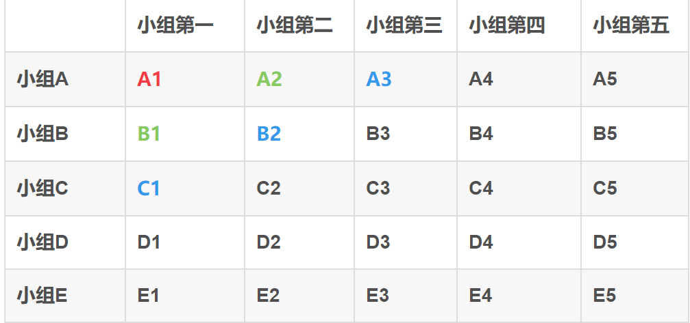

# FT专题

## 25匹马，5条跑道，最少次数找出最快的5匹马

显然，7次

首先分成5组，各跑一次，用掉5次

各组第一，来一次，用掉1次，此时已经决出最快的马

还剩第二第三



最快的就是左上角的那几个

## 电梯测试用例设计

1、功能测试：

（1）按钮功能，开门（运行中按开门键不开门），关门，电梯内按钮功能（电梯按键在按下时是否点亮，按错楼层是否可以取消）；

（2）上升，下降（每一层申请是否有效，是否可以正常停靠），超载时是否会忽略其它楼层的上行和下行申请，电梯的两边按钮是否都可以使用；

（3\) 电梯内电话、灯光等

2、性能测试：反应时间、关门时间、速度\(是否造成人体不适）

3、压力测试：超载，碰撞电梯壁

4、安全测试：

（1）进入电梯喊话，外面是否听到，拨打手机是否有信号；

（2）停电（不会坠落。电梯门可以通过外力打开，紧急电话可用），报警装置（超载），通风状况；

（3\) 停靠位置，有人扒门（不会强制关门），若有异物阻碍，会停在当前楼层；

\(4\) 监控装置

5、UI测试：标识的承重和人数，仅提供可到达楼层的按钮，美观程度，光滑程度、形状

6、可用性：按键高度、操作是否方便

7、稳定性：长时间运行情况

## 输出1-100里面的所有质数

什么是质数？只能被自己和1整除的数。

显然，两层循环，第一层遍历1到100（不包含1）

第二层从2开始，到这个数截至，不断取模，出现了0则break

```python
result = []
for i in range(2, 101):
    flag = True
    for j in range(2, i):
        if i % j == 0:
            flag = False
            break
    if flag == True:
        result.append(i)
print(result)
```

## 实现斐波那契数列

迭代，递归，带缓存的递归

```python
class Solution:
    def fib(self, N: int) -> int:
        '''递归
        if N < 2:
            return N
        return self.fib(N-2) + self.fib(N-1)
        '''

        '''迭代
        if N < 2:
            return N
        
        a = 0
        b = 1

        for i in range(N):
            a, b = b, a+b
        return a
        '''
        
        '''带缓存的递归
        
        if N < 2:
            return N
        
        if N in self.cache:
            return self.cache[N]
        else:
            self.cache[N] = self.fib(N-2)+self.fib(N-1)
        return self.cache[N]

    def __init__(self):
        self.cache = {}
    '''
```

## 3栈灯，3个开关，一个房间，一次开门的机会，找出3个开关各个对应的灯

利用灯的温度，其他的你懂的

## 7L水杯和5L水杯倒出6L水

这个问题可以转换为怎么得到１升＋５升的水

然后就是3次装满5L的桶，然后不停往7L倒，得到1L，然后就是6L了

## 准备准备关于使用过的测试框架的原理

## 七层网络模型，介绍下每一层，TCP在第几层，TCP、UDP是什么，有什么区别？

老生常谈

## 测试流程？

讲一讲自己的工作流程吧

先是需求评审，测试用例评审，完善测试用例，测试计划评审，系统测试进行测试执行，提交Bug并输出测试报告，2-3轮回归，版本上线，追踪用户反馈

## 什么是边界值法和等价类划分法？两者区别

等价类划分是在允许输入的区间里面找出一组合理的值，代替遍历整个区间的一种测试方法

边界值则是在这个区间的边界和超过边界的部分挑选值，去进行测试

## python生成100个不重复的4位数随机数

两种方法，一种利用库函数

可以结合洗牌算法阐述实现的思想

## 1000瓶水，需要多少只小白鼠找到有毒的那瓶

不断二分查找，最坏的情况下需要多少次比较？log2 1000 = 10

## 烧绳子

烧一根需要60min，现在需要45min

拿两根出来，一根点燃两端，另一根点燃一端，两端同时点的烧完了是30min，此时再点燃另外一根的两端，也烧完了是45min

## 求前n项和

一个for就行了

## 判断两个升序数组其中一个是另外一个数组的子集

非常典型的用字典做会好一点

## 括号的匹配问题，如{\(\)},{\[\(\)\]},\({\[\]}\)都匹配的

用栈

## 常见的排序算法呢

冒泡排序，选择排序，这两个老哥，一个每次选出最大，一个每次选出最小

插入排序

快速排序


